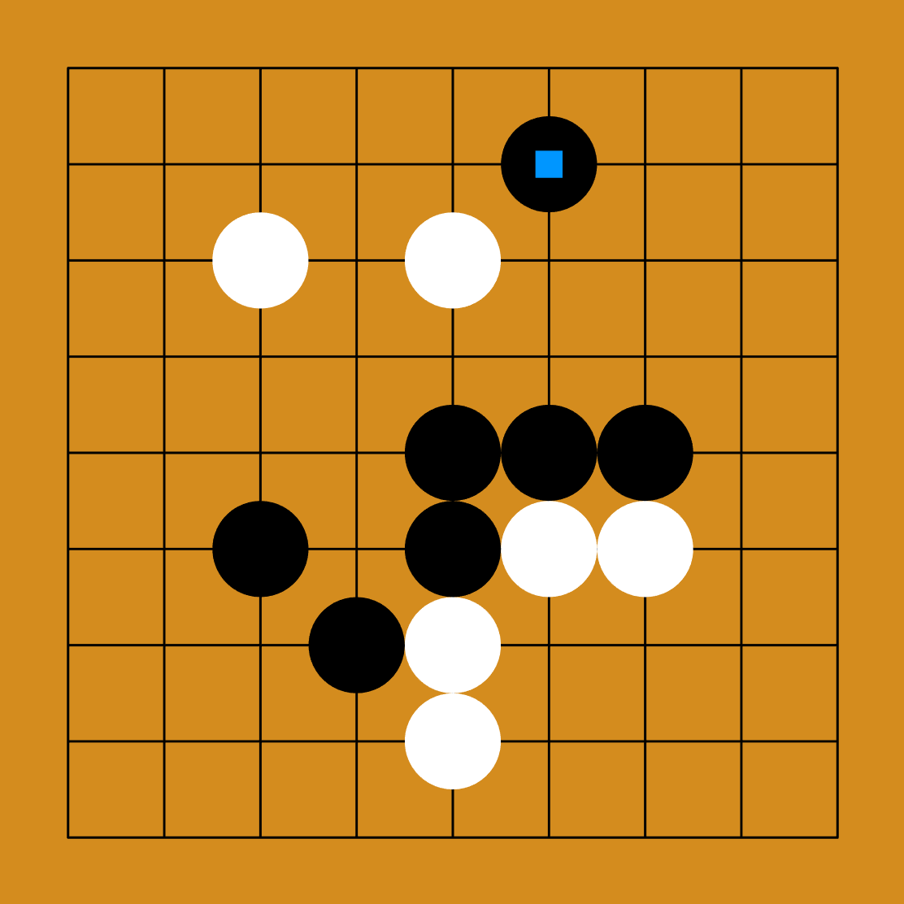
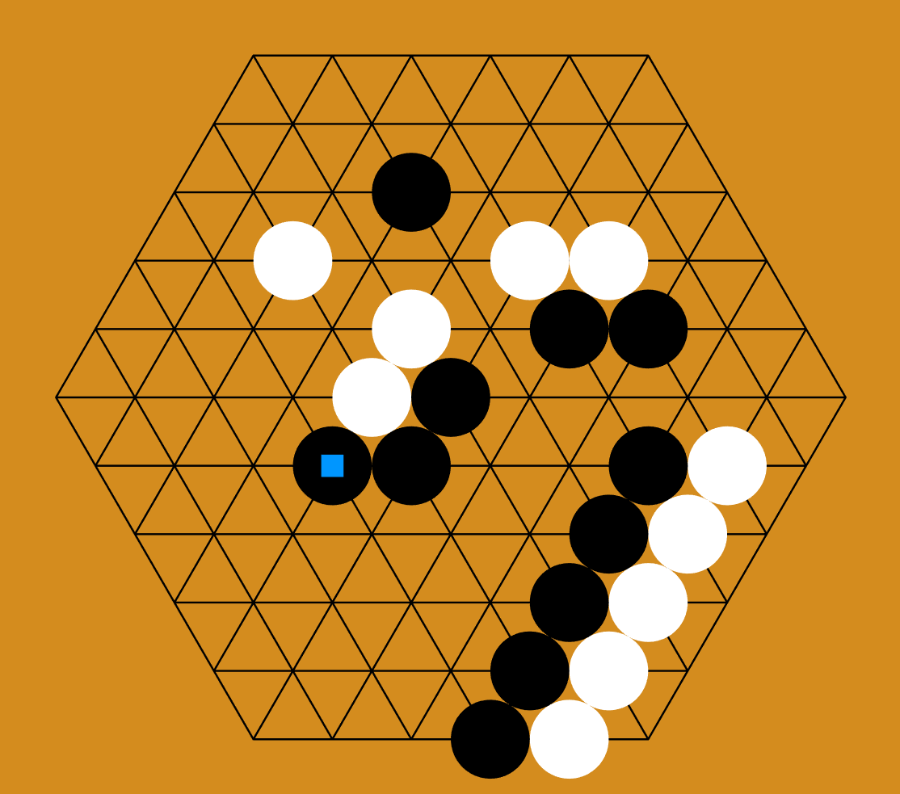
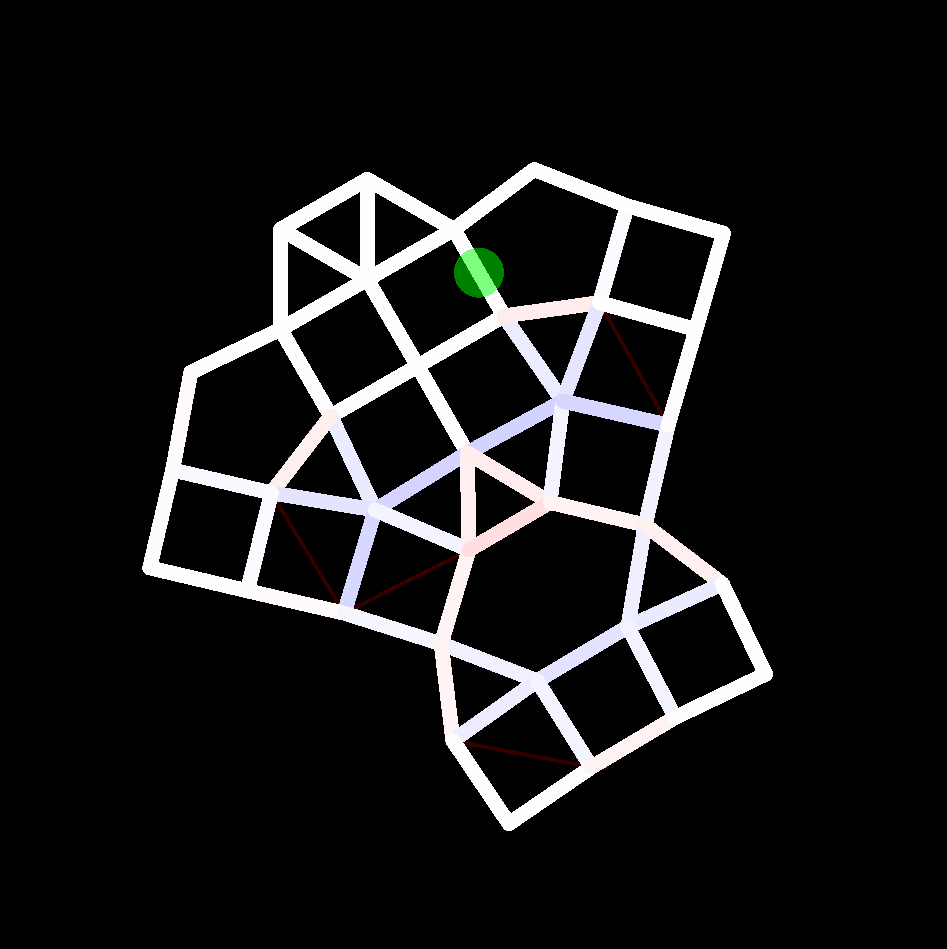
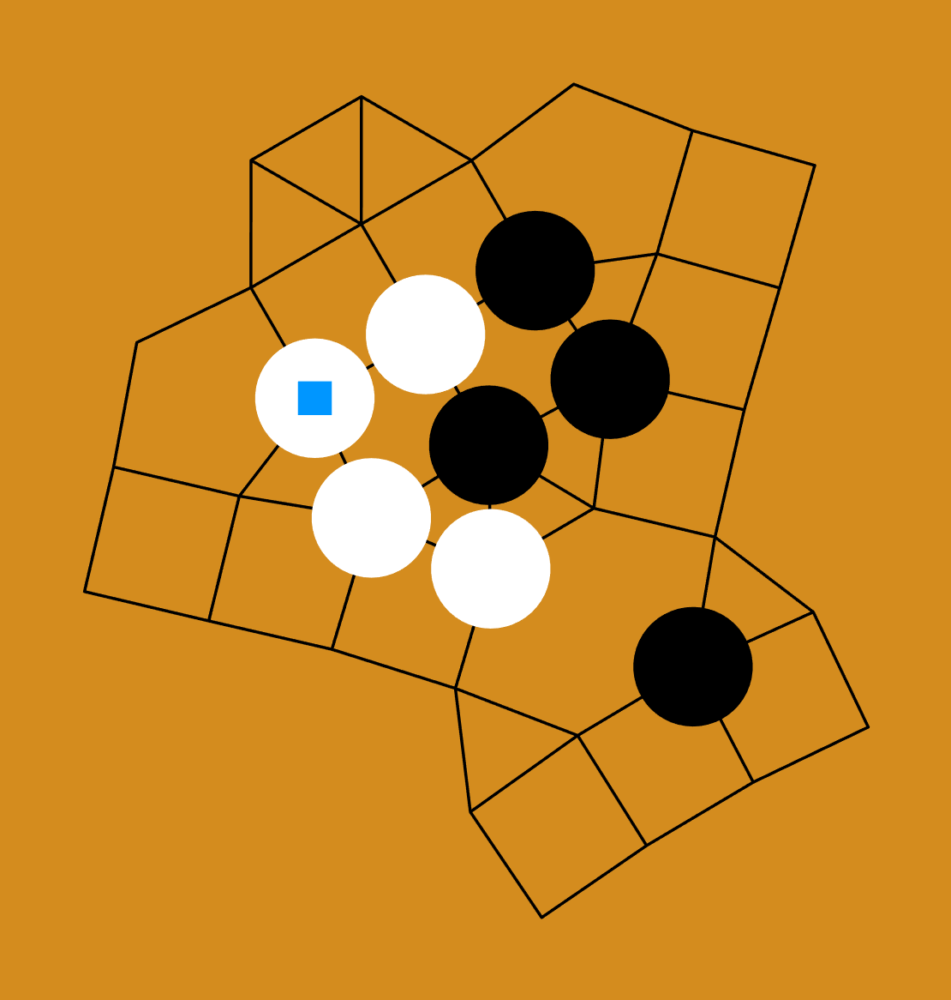

# Description

This tool is an analyzer for board positions in the game of [Go](https://en.wikipedia.org/wiki/Go_(game)). It can be used to analyze positions on standard boards (19×19, 13×13, 9×9) as well as non-standard boards. The non-standard boards can be rectangular boards of unconventional sizes (5×13, 19×2, etc) or even non-rectangular boards. The program comes packaged with a dozen preset board types, and a graphical tool you can use to design your own. Analyses are saved in files with the `.san` extension and can be opened again later.

 

  
  

